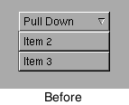
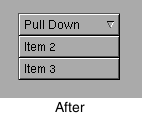
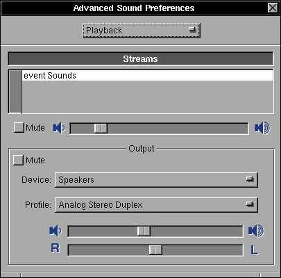

#  NEXTSPACE News

### 14.05.2020

Hi!

Short summary of what was going on during last 3 months.

**More enhancements to GNUstep frameworks:**
- Main application menu follows key window. If you have multiple windows opened on different monitors you always have main menu visible on monitor where focused (key) window resides. It is likely the window your attention is on at the moment. This feature is dynamical - moving focused window move main menu after you release mouse button.
- Application menus (main and submenus) are constrained to monitor visible area. You are unable to move menu past the top and left edges. If you want to moved menu down movement constrained to keep menu title visible and readable. This feature quite handy if your main menu was moved out of inital position (top left corner) and you want to return it back.

**NEXTSPACE changes:**
- I've made switch to LLVM/clang setup provided by RedHat SCL repo. No differences were noticed since then. This change made possible to set up some automation (compile, build pacakges) in repetitive manner.
- Continous Integration (CI) was configured to use CircleCI. Thanks to @enzuru.
- Successful attempt to create NEXTSPACE Live CD by @nicktelindert ([isssue #242](https://github.com/trunkmaster/nextspace/issues/242)). Look [here](https://github.com/nicktelindert/nextspace-build-iso) for details.
- I've created a `nextspace` branch in GNUstep's -back and -gui repos for changes which are not accepted into `master` for various reasons.
- I've started to develop network configuration application. It leverages [DBusKit](https://github.com/gnustep/libs-dbuskit) to communicate with NetworkManager. It's in early shape but it works in general.

**Release 0.90**

Due to the high demand of various modern distributions support and the major changes to code, I've decided to make a new intermediate NEXTSPACE release - 0.90. During the preparation to release I plan to finish these tasks:
  - scripts for automated build of RPMs (done)
  - automated install for CentOS 7, CentOS 8, Fedora 31 RPMS (in progress)
  - updated Build and Install guides: it should be much simpler with automation tools (in progress).
  
Take care of yourself and prepare for new release!

### 31.01.2020

Hello evrybody!

I wrote news long time ago. If you think I'm out of business - no way! - I'm still here.
I've finally put my hands onto GNUstep improvements that were waiting for good times.

Actually a bunch of good things have happend:
- GNUstep now supports dynamic screen parameters changes (resolution, layout). It means that calls to NSScreen class returns actual correct values for -frame. It doesn't mean that my SystemKit's classes OSEScreen and OSEDisplay should gone. Quote form Apple documentation: "The NSScreen class is for getting information about the available displays only. If you need additional information or want to change the attributes relating to a display, you must use Quartz Services.". That's it - SystemKit classes provides ability to mainpulate display layouts, switch on/off displays an so on.
- I've done some routine work to make GORM more usable: Inspectors, Palettes, Inspector shortcuts (Cmd+1, Cmd+2,...) works across the GORM application.
- My GNUstep backend fixes to input focus handling almost completely adopted (one PR has already submitted). It means switch between workspace now works with latest GNUstep sources. Plus you should never see several application menus visible at once (very annoyed me!).
- Active/inactive application icons: now they looks correct. It involved GNUstep and WM (wraster) fixes.
- Insertion point height fixed. It was clearely noticable on text fields with big font size set (Login panel). If text field is empty insertion point is small (as for font with 12 size) and grows bigger on first character entered. It's not the case now.
- Various other: NSScroller and NSBrowser sizing, NSTableView header view correct drawing, NSStepper now looks much cleaner.

Most of the patches in Libraries/gnustep are gone and one patch was added: fixes pulldown menu display in NSPopupButton.
This patch cannot be merged into GNUstep source tree for the simple reason: GNUstep tries to mimic the MacOS behavior which is not compatible to NEXTSTEP's. Here are screenshots for the record of what my changes are (do you see the difference?):

 

As a result I've closed "Switch to the latest release of GNUstep" milestone.
Although I need some time to check all the sharp edges which floats around due to use of HEAD GNUstep sources.

As you can see some improvements are fundamental, some - cosmetic. But all of this promises bright future to both GNUstep and NEXTSPACE projects.

P.S.: Do not hesitate to write some kind words to [me](mailto:stoyan255@gmail.com)! This is a fuel for open source developer's engine (at least for me).

Stay tuned!

### 15.09.2019

The summer has gone and it's time for some news. I was quite busy with NEXTSPACE since 0.85 release during the summer time. I've created as [ChangeLog](https://github.com/trunkmaster/nextspace/blob/master/Documentation/Changelog.md) file and periodically throw some info about progress there.

Short summary:
- Login and Workspace got stability and interconnection improvements.
- Workspace's Copy operation now 4 times faster then before.
- "Power Off" button in Workspace's Logout panel now powering off the machine.
- Some modules in Preferences were improved, "Password Preferences" was implemented (almost works).
- New custom open ans save panels. Much improved usability against vanilla GNUstep panels. New panels honors "Show Hiddes Files" setting (Expert Preferences in Preferences application).

And last but not least NeXTSTEP compatible Help Panel! Just look at this:


 You see original documentation for Workspace Manager (uses RTF, RTFD and TIFF formats) I've copied from OPENSTEP for development purposes. For obvious reasons it cannot be used as is in NEXTSPACE. If you have good English and like NEXTSPACE idea I encourage you to write documentation.

### 12.06.2019
NEXTSPACE 0.85 [is out](https://github.com/trunkmaster/nextspace/releases/tag/0.85).
This is the first release that one can use without compiling - everything can be installed as RPMs.

Enjoy the NeXT!

### 25.05.2019
Almost 2 months have passed since previous news and a lot of things happend.

**First,** I've decided to bake a new intermediate release of NEXTSPACE - 0.85. The
main idea behind this intention is to present bunch of changes against 0.8 version 
(including genuine frameworks and applications). Here they are:

- New build toolchain - **clang 7.0.1** with some backported patches from 8.0.
- New version of **libdispatch from Apple Swift 5.0** repository.
- Bleeding edge versions of **GNUstep Make, Base, GORM, ProjectCenter**;
- New version of **libobjc2 - 2.0**.
- Refactored NXAppKit, NXFoundation frameworks and merged into **DesktopKit** - this is more relevant name to reflect purpose of included classes (however classes prefix was changed from `NX` to `NXT` to save link to NeXT - classes are aimed to bring NeXT desktop experience);
- NXSystem renamed into **SystemKit** - classes prefix OSE - stands for Operating System Environment. OS and X11 specific classes;
- New **SoundKit framework**. The basic idea behind the kit is to provide sound output and input facility to applications, sound control (per application and per output mixer: mute, volume, profiles). Encoding and decoding of sounds (read/write formats, tags handling, etc) is a responsiblity of the applications (or maybe a separate framework like MusicKit).
- **Sound Preferences** - uses sound controls facility of SoundKit - 
- Handcrafted **mouse cursor theme** - mix of NeXT and MacOS styles (details are [here](https://github.com/trunkmaster/nextspace/wiki/Mouse-Cursors)).
- NeXT like, but colorful animated boot splash **Plymouth theme**.
- Plenty of enhancements and fixes to **Workspace**. I don't recall all of them (most of them described at [Workspace project page](https://github.com/trunkmaster/nextspace/projects/4)). Main areas of interest are:
  
  - appicons: click, double-click, right-click menu;
  - window focus handling: manual switch between windows of application and applications; Dock and Icon Yard management (configuration and hiding/showing); focus switch on window appearing and closing; focus switch after workspace switch;
  - visual (window shaking) and audible bell (configurued in Sound Preferences);
  - uniform behaviour of X Window and GNUstep applications for hide/miniaturize/maximize actoins;
  - Recycler, Icon Viwer and Launcher implementation and fixes;
  - drag and drop fixes in File Viewer, Recycler. Applications can be dragged and dropped from Fiel Viewer's Shelf into Dock.
  - configurable autolaunch of docked applications;
  - workspaces configuration (count, shortcuts, display active workspace number in appicon);
  - session management: remember applications on logout and restart on logon;
  - etc.
- TimeMon and TextEdit cleanups;

**Second,** almost all my patches to GNUstep libraries went upstream. Although I've 
decided to base 0.85 release on quite outdated version of GNUstep GUI and Back 
libraries - 0.25.0 (current version is 0.27.0). This is due to the 2 reasons: 1. I 
sticked to the ART GUI backend. 2. 0.25.1 version intruduced regresssion in string 
drawing (NSStringDrawing now has rewritten cache handling which works weird 
with ART backend). I will return to master branch of GUI and Back after I'll be happy 
with NEXTSPACE functionality implementation.

**So,** for the next several weeks I plan to create the 0.85 release. After that I'll continue to close issues tagged to 1.0 release.

Keep calm and be happy. :)

### 09.04.2019
Last month was dedicated to several activities.

- **Projects, tasks, issues and milestones:**
You may noticed a lot of issues has been appeared. I've converted all tasks in projects into issues with link to milestones. 
I guess it's more noticeable way to present project progress. Also it's handy to have some history of features evolution for
writing future documentation.

- **Sound:** _SoundKit_ now has implemented methods for sound subsystem properties control (volume, mute, etc.). Play/record 
functionality will be the next task. All _Sound Preferences_ controls has been implemented except "Advanced Sound Preferences" 
panel(Mixer).

- **Workspace:** rewritten application termination sequence. I had to implement private NSApplicationMain() to quit runloop 
and return to main(). After that Workspace can correctly finish window manager lifecycle. Defaults written to disk on 
application quit - no more defaults corruption and application segfualting occur. Removed a lot of WindowMaker resources and code. Now it's part of Workspace is not WindowMaker anymore. It's Window Manger or WM. I plan to get rid of WINGs and rewrite 
WM on Objective-C (likely in version 2.0).

- **Build toolchain:** I've decided to push my local changes to upstream project - GNUstep. During the prepare I switched to LLVM/clang 7.0.1, libdispatch updated to current github code (it seems they have implemented it's own kqueue and 
pthread_workqueue - no need to have additional packages), libobjc2 2.0, GNUstep Make 2.7.0. There are no RPMs so far.

- **GNUstep:** merged improvements are: _autolaunch_ functionality, interconnection with WM during application hiding, GNUstep appicon now passes double-click to WM, fixes to "Font Panel" weird look and behaviour on WM.

I've lost my writing permissions to GNUstep repository and pushing chages to GNUstep takes more time than I plan to spend.
GNUstep _art_ backend now marked as deprecated. IMHO _cairo_ backend need more fixes to be considered as "production ready".
Despite of this, _cairo_ backend looks promising and I'll continue to make fixes and improvements to it.
Meanwhile, current NEXTSPACE implementation will stick to _art_ and outdated Base, GUI and Back.

### 22.02.2019
Excercising with Linux audio subsystem I end up with SoundKit framework implementation :). It's quite similiar to
the NeXT's one, however, due to asynchronous nature of PulseAudio it's different in some places. This framework aimed to 
provide access to sound subsystem properties in quite simple fashion for both type of applications: mixer and
player/recorder. I want it to have switchable backends (ALSA, PulseAudio, OSS). Here is a supposed code example:
```objectivec
#import <Fountation/Foundation.h>
#import <SoundKit/SoundKit.h>

- (void)playSound
{
  SKSoundServer *server;
  SKSoundOut    *output;
  SKSoundStream *stream;

  server = [[SKSoundServer alloc] initOnHost:nil
                                        type:SKPulseAudioType];
  output = [server defaultOutput];
  stream = [[SKSoundPlayStream alloc] initOnDevice:output];

  // some code to open sound file, decoding it's contents into `buffer`

  [stream playBuffer:buffer size:bufferSize];

  [stream release];
  [output release];

  [server disconnect];
  [server release];
}
```

The first task is to implement parts of SoundKit to have a working Mixer for sound properties adjustements: volume 
(common and application specific), mute, output/input port and profile selection. This task involves implementation of
SoundServer, SoundDevice and SoundOut/SoundIn classes. The next task is implementation of stream classes for play/record.
 
For the testing purposes I created the Player application (very simple) with integrated Mixer.


More to come - stay tuned! Have a nice days!

### 21.01.2019
Last month I've spent for exercises with Linux audio subsystems. Namely ALSA and PulseAudio. For that reason I've 
created a application Mixer inside Frameworks/Tests. There some results:
* I have fully working ALSA mixer (thanks to [@alexmyczko](https://github.com/alexmyczko) for his [VolumeControl.app](https://github.com/alexmyczko/VolumeControl.app) - that was a starting point for me).
* ALSA and PulseAudio events handling implemented in separate GCD thread for both subsystems.
* PulseAudio looks like more preferred method of sound card settings tweaking:
    * I can easily determine default input and output. This is important for "Sound Preferences" panel where only 2 
    simple controls provided by design.
    * I can switch input and output on per application basis.
    * It will be possible to add comprehensive sound routing management in future "Sound Mixer". 
* NextSpace needs separate application - "Sound Mixer" - to perform more complex sound settings edidting (switching 
outputs, selecting input device for sound capturing, etc.)

I need to finish PulseAudio code inside Mixer. Next is create NXSound implementation that can manage ALSA and PulseAudio
with one set of methods.

Here are some screenshts of Mixer:

    

### 24.12.2018

I guess now I've fixed most of the focus switch issues. Moreover, now GNUstep GUI backend correctly process "Hide" and
"Minimize Window" operations with respect to WM application state information. "Hide" sends message to WM. WM draws 
animation of hiding application and mark application windows as hidden. This is very important to have GNUstep and WM 
vision synchronized.

> For the record - there are several methods of performing such operations:
> * Hide - Cmd-h shortcut, right-click on Miniaturize window titlebar button, "Hide" right-click menu on appicon (for 
> X11 applications only).
> * Miniaturize Window - Cmd-m, left-click on Miniaturize titlebar button
> For GNUstep applications these operations are handled differently then to X11 applications.

Now I'm developing inside NEXTSPACE environment. I suppose that more bugs will be revealed. However I'm switching to 
other project tasks (Preferences, Terminal). 

### 13.12.2018

Fixes, fixes, fixes... to focus management again. 

Last couple of days I've tested focus management with IntelliJ IDEA.
This application has interesting startup sequence from focus management point of view. Now WM became more mature in 
handling such applications. 

### 11.12.2018

I've finished documenting some aspect of focus management. Although extensive testing, fixing and polishing are ahead.
Because of frequent crashes and logouts/logins, I make development inside VM. 
Once I'll be happy with focus management feature, I move to real hardware. That's where I can deal with sound, power, 
networking.

### 08.12.2018

It seems that I've completed focus management task.
Additinally I've managed to fix misterious unmap/map of appicon on double-click.

Next: I need to document all changes and describe concepts of focus management related things.

### 06.12.2018

Several major changes in focus management task:
1. GNUstep GUI backend activate application if TakeFocus message was received
   from WM.
2. When GNUstep application deactivates main menu left managed by WM now. Considering
   change to GNUstep GUI backend, main menu can now be used to activate GNUstep application
   with WM's wSetFocusTo() without direct calling of `[NSApp activateIgnoringOtherApps:]` (it's
   implemented in XWActivateApplication).
3. Cmd-Tab (Switch Panel) now creates list of applications (not windows). Switch to application
   that was openened on particular workspace switches to that workspace.
   
Next: double-click on appicon should switch to workspace where app was opened.

### 04.12.2018

Latest update to CentOS 7.6.1810 brings some big changes. What I noticed is:
- freetype library upgrade from vaersion 2.4 to 2.8. freetype 2.8 introduced new 
  version of TrueType interpreter - v40. As a result non-aliased hinted fonts 
  looks ugly. Perhaps new interpreter has broken font hints processing.
  Although antialiasing works much better - antialiased fonts looks good with 
  `hintslight` setting of `hintstyle` parameter of fontconfig (or Xft.hintstyle).
  Return to old version of interpreter is possible if you set environment 
  variable `FREETYPE_PROPERTIES` like this:
  `export FREETYPE_PROPERTIES="truetype:interpreter-version=35"`
- new kernel update 3.10.0-957 brings problem of bulding VirtualBox video driver
  for guest CentOS system. VirtualBox development build 5.2.23 fixes this.

### 23.11.2018

Last 2 weeks I was trying to marry GNUstep GUI backend focus management with WM's.
It's quite hard task... But now I know how focus management works in GNUstep and X11.
Next [Workspace project](https://github.com/trunkmaster/nextspace/projects/4) 
tasks probably require more deep integration between GNUstep and WM.
