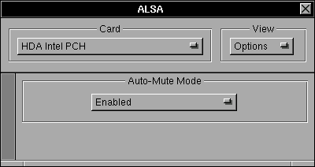

#  NEXTSPACE News

### 09.04.2019
Last month was dedicated to several activities.

- **Projects, tasks, issues and milestones:**
You may noticed a lot of issues has been appeared. I've converted all tasks in projects into issues with link to milestones. 
I guess it's more noticeable way to present project progress. Also it's handy to have some history of features evolution for
writing future documentation.

- **SoundKit:** finished implementation of methods to control sound subsystem properties (volume, mute, etc.). Play/record 
functionality will be the next task.

- **Workspace:** rewritten application termination sequence. I had to implement private NSApplicationMain() to quit runloop 
and return to main(). After that Workspace can correctly finish window manager lifecycle. Defaults written to disk on 
application quit - no more defaults corruption and application segfualting occur. Removed a lot of WindowMaker resources and code. Now it's part of Workspace is not WindowMaker anymore. It's Window Manger or WM. I plan to get rid of WINGs and rewrite 
WM on Objective-C (likely in version 2.0).

- **Build toolchain:** I decide to push my local changes to upstream project - GNUstep. During the preperation process I switched to LLVM/clang 7.0.1, libdispatch updated to current github code (it seems they implemented it's own kqueue and 
pthread_workqueue - no need to have additional packaged for it), libobjc2 2.0, GNUstep Make 2.7.0. There are no RPMs so far.

- **GNUstep:** merged improvements are: _autolaunch_ functionality, interconnection with WM during application hiding, GNUstep appicon now passes double-click to WM, fixes to "Font Panel" weird look and behaviour on WM.

I've lost my writing permissions to GNUstep repository and pushing chages to GNUstep takes more time than I plan to spend.
GNUstep _art_ backend now marked as deprecated. IMHO _cairo_ backend need more fixes to be considered as "production ready".
Despite of this, _cairo_ backend looks promising and I'll continue to make fixes and improvements to it.
Meanwhile, current NEXTSPACE implementation will stick to _art_ and outdated Base, GUI and Back.

### 22.02.2019
Excercising with Linux audio subsystem I end up with SoundKit framework implementation :). It's quite similiar to
the NeXT's one, however, due to asynchronous nature of PulseAudio it's different in some places. This framework aimed to 
provide access to sound subsystem properties in quite simple fashion for both type of applications: mixer and
player/recorder. I want it to have switchable backends (ALSA, PulseAudio, OSS). Here is a supposed code example:
```objectivec
#import <Fountation/Foundation.h>
#import <SoundKit/SoundKit.h>

- (void)playSound
{
  SKSoundServer *server;
  SKSoundOut    *output;
  SKSoundStream *stream;

  server = [[SKSoundServer alloc] initOnHost:nil
                                        type:SKPulseAudioType];
  output = [server defaultOutput];
  stream = [[SKSoundPlayStream alloc] initOnDevice:output];

  // some code to open sound file, decoding it's contents into `buffer`

  [stream playBuffer:buffer size:bufferSize];

  [stream release];
  [output release];

  [server disconnect];
  [server release];
}
```

The first task is to implement parts of SoundKit to have a working Mixer for sound properties adjustements: volume 
(common and application specific), mute, output/input port and profile selection. This task involves implementation of
SoundServer, SoundDevice and SoundOut/SoundIn classes. The next task is implementation of stream classes for play/record.
 
For the testing purposes I created the Player application (very simple) with integrated Mixer.


More to come - stay tuned! Have a nice days!

### 21.01.2019
Last month I've spent for exercises with Linux audio subsystems. Namely ALSA and PulseAudio. For that reason I've 
created a application Mixer inside Frameworks/Tests. There some results:
* I have fully working ALSA mixer (thanks to [@alexmyczko](https://github.com/alexmyczko) for his [VolumeControl.app](https://github.com/alexmyczko/VolumeControl.app) - that was a starting point for me).
* ALSA and PulseAudio events handling implemented in separate GCD thread for both subsystems.
* PulseAudio looks like more preferred method of sound card settings tweaking:
    * I can easily determine default input and output. This is important for "Sound Preferences" panel where only 2 
    simple controls provided by design.
    * I can switch input and output on per application basis.
    * It will be possible to add comprehensive sound routing management in future "Sound Mixer". 
* NextSpace needs separate application - "Sound Mixer" - to perform more complex sound settings edidting (switching 
outputs, selecting input device for sound capturing, etc.)

I need to finish PulseAudio code inside Mixer. Next is create NXSound implementation that can manage ALSA and PulseAudio
with one set of methods.

Here are some screenshts of Mixer:

    

### 24.12.2018

I guess now I've fixed most of the focus switch issues. Moreover, now GNUstep GUI backend correctly process "Hide" and
"Minimize Window" operations with respect to WM application state information. "Hide" sends message to WM. WM draws 
animation of hiding application and mark application windows as hidden. This is very important to have GNUstep and WM 
vision synchronized.

> For the record - there are several methods of performing such operations:
> * Hide - Cmd-h shortcut, right-click on Miniaturize window titlebar button, "Hide" right-click menu on appicon (for 
> X11 applications only).
> * Miniaturize Window - Cmd-m, left-click on Miniaturize titlebar button
> For GNUstep applications these operations are handled differently then to X11 applications.

Now I'm developing inside NEXTSPACE environment. I suppose that more bugs will be revealed. However I'm switching to 
other project tasks (Preferences, Terminal). 

### 13.12.2018

Fixes, fixes, fixes... to focus management again. 

Last couple of days I've tested focus management with IntelliJ IDEA.
This application has interesting startup sequence from focus management point of view. Now WM became more mature in 
handling such applications. 

### 11.12.2018

I've finished documenting some aspect of focus management. Although extensive testing, fixing and polishing are ahead.
Because of frequent crashes and logouts/logins, I make development inside VM. 
Once I'll be happy with focus management feature, I move to real hardware. That's where I can deal with sound, power, 
networking.

### 08.12.2018

It seems that I've completed focus management task.
Additinally I've managed to fix misterious unmap/map of appicon on double-click.

Next: I need to document all changes and describe concepts of focus management related things.

### 06.12.2018

Several major changes in focus management task:
1. GNUstep GUI backend activate application if TakeFocus message was received
   from WM.
2. When GNUstep application deactivates main menu left managed by WM now. Considering
   change to GNUstep GUI backend, main menu can now be used to activate GNUstep application
   with WM's wSetFocusTo() without direct calling of `[NSApp activateIgnoringOtherApps:]` (it's
   implemented in XWActivateApplication).
3. Cmd-Tab (Switch Panel) now creates list of applications (not windows). Switch to application
   that was openened on particular workspace switches to that workspace.
   
Next: double-click on appicon should switch to workspace where app was opened.

### 04.12.2018

Latest update to CentOS 7.6.1810 brings some big changes. What I noticed is:
- freetype library upgrade from vaersion 2.4 to 2.8. freetype 2.8 introduced new 
  version of TrueType interpreter - v40. As a result non-aliased hinted fonts 
  looks ugly. Perhaps new interpreter has broken font hints processing.
  Although antialiasing works much better - antialiased fonts looks good with 
  `hintslight` setting of `hintstyle` parameter of fontconfig (or Xft.hintstyle).
  Return to old version of interpreter is possible if you set environment 
  variable `FREETYPE_PROPERTIES` like this:
  `export FREETYPE_PROPERTIES="truetype:interpreter-version=35"`
- new kernel update 3.10.0-957 brings problem of bulding VirtualBox video driver
  for guest CentOS system. VirtualBox development build 5.2.23 fixes this.

### 23.11.2018

Last 2 weeks I was trying to marry GNUstep GUI backend focus management with WM's.
It's quite hard task... But now I know how focus management works in GNUstep and X11.
Next [Workspace project](https://github.com/trunkmaster/nextspace/projects/4) 
tasks probably require more deep integration between GNUstep and WM.
